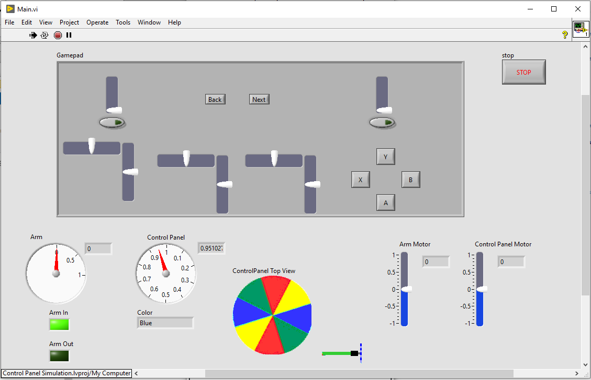

# FRC LabVIEW 2020 Control Panel Challenge

This LabVIEW project simulates a robot capable of turning the Control Panel.  The robot has an arm with a manipulator at the end of the arm to turn the Control Panel.  Initially the arm is retracted.  The robot contains two motors.  One extends and retracts the arm.  The other engages the manipulator to turn the Control Panel.

Have fun and learn something!

## Description

The Control Panel starts at a random location.

The TeleOp VI can read the simulated game data, letting you know the desired color position.

The top half of Main.VI is a simulated game controller.  These are the controls you can use to initiate actions of the robot.

The bottom half of Main.VI shows the robot arm positioned next to the Control Panel.  It shows the Control Panel as if you are looking down on it.  It also serves as a Dashboard allowing the drivers to see what is occurring.

This is a screen shot of Main.VI

Be careful, it is possible to break the simulated robot if the arm or manipulator are moved incorrectly!

## Goal

Write control code in TeleOp.VI to move the arm and the Control Panel manipulator to turn the Control Panel as required by the FRC 2020 game rules.  The control code can manually manipulate the arm and arm manipulator from the game controller, or it can use game controller inputs to initiate automatic commands.

## Instructions

1. Changes are only allowed to the TeleOp.VI and Main.VI (on the Main.VI only new indicators of data accessible from inside the TeleOp.VI are permitted).

2. Write code to display the Game Data on the simulated Dashboard (Main.VI).

3. Write code to extend and retract the robot arm using game controller inputs.

4. Write code to move the manipulator to turn the Control Panel using game controller inputs.

5. Write code to initiate an automatic action to engage the arm, turn the Control Panel, then retract the arm as required for Rotation Control as documented in the [2020 Game Manual](https://firstfrc.blob.core.windows.net/frc2020/Manual/2020FRCGameSeasonManual.pdf).

6. Write code to initiate an automatic action to engage the arm, turn the Control Panel, then retract the arm as required for Position Control as documented in the [2020 Game Manual](https://firstfrc.blob.core.windows.net/frc2020/Manual/2020FRCGameSeasonManual.pdf).
