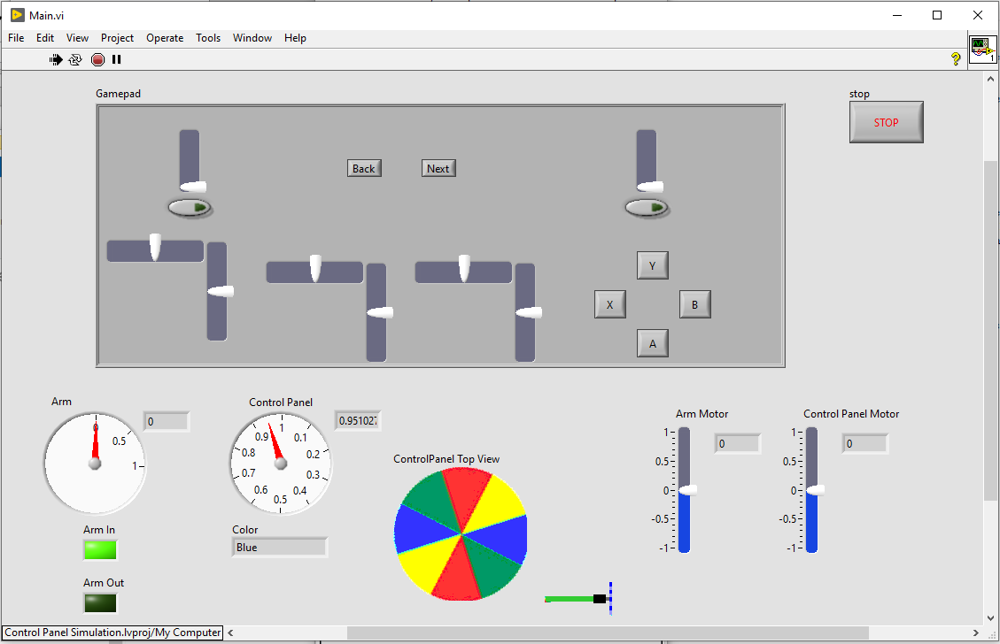

# FRC Simulation Challenges

This repository contains a number of LabVIEW projects that can be used as LabVIEW exercises for FRC robot control system training, practice, and FUN.

Each project has its own README.md file containing instructions for the exercise.

Have fun and learn something!

## Here are the current projects:

### 2020 Control Panel

This is a simulation of the 2020 Control Panel, and a robot with a wheel and arm mechanism to turn the Control Panel. Write code in the TeleOp VI to move the Control Panel per the 2020 Infinite Recharge rules without changing any other VIs. You can start with manual controls and then move on to more automated controls.

## Contributing New or Improved Challenges

Feel free to make improvements to the simulations or submit LabVIEW projects with new challenges of other FRC mechanisms by creating issues or pull requests on GitHub at https://github.com/superhornets/FRC-Simulations.
